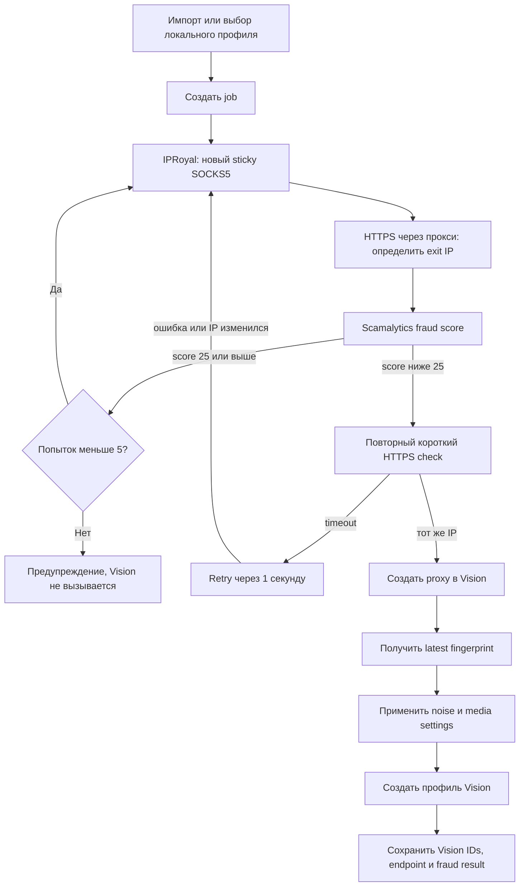

# Architecture

## Карта проекта

```text
admin_panel/
  app.py             HTTP server, REST API, auth, static files
  core.py            SQLite schema, parsing, statuses, jobs, trash, TOTP
  integrations.py    Vision, IPRoyal, Scamalytics, SOCKS5/TLS checks
  jobs.py            creation job execution
  worker.py          persistent server-side job worker
  bot.py             Telegram bot and admin API client
  security.py        request/auth security helpers
  static/
    index.html        dialogs and page shell
    app.js            client state, rendering and interactions
    styles.css        responsive dark UI
  start.ps1          local launcher
tests/
  test_admin_panel.py
  test_admin_integrations.py
  test_admin_security.py
  test_admin_bot.py
deploy/README.md      private VPS deployment
compose.yaml          web + worker + bot
```

## Runtime

Локально `admin_panel.app` использует встроенный HTTP server и inline worker. На сервере `ADMIN_INLINE_WORKER=0`, а jobs обрабатывает `admin_panel.worker`.

Основные адреса:

```text
GET  /healthz
GET  /api/accounts
GET  /api/countries
GET  /api/authenticator/codes
GET  /api/trash
GET  /api/jobs/{id}
GET  /api/accounts/{id}/ip-history
POST /api/import
POST /api/jobs
POST /api/sync
POST /api/accounts/{id}/authenticator
POST /api/accounts/{id}/fraud-check
POST /api/accounts/{id}/proxy-credentials
POST /api/accounts/{id}/rotate-proxy
POST /api/accounts/{id}/delete-vision
POST /api/trash/{id}/restore
```

## Данные

SQLite по умолчанию:

```text
admin_panel/data/profiles.sqlite3
```

Таблицы:

- `accounts` — локальная модель профиля, ссылки Vision, proxy metadata, score, TOTP secret и status.
- `jobs` — состояние пакетных задач.
- `job_accounts` — связь задач и профилей.
- `account_trash` — JSON snapshot удаленной записи.
- `ip_history` — лог проверок fraud score: IP, score, risk level и timestamp для каждого профиля.

API списка аккаунтов использует public projection: TOTP secret не возвращается, вместо него передается только `has_authenticator`.

## Статусы профиля

- `ready` / `not_created` — профиль существует только локально.
- `queued` — добавлен в задачу создания.
- `running` — создание выполняется.
- `created` — существует в Vision и локально синхронизирован.
- `pending_sync` — локальные поля изменились и должны быть отправлены в Vision.
- `rotating` — меняется прокси.
- `deleting` — удаляется профиль Vision.
- `error` / `interrupted` — операция завершилась ошибкой или была прервана.

Busy-статусы блокируют конфликтующие действия.

## Поток создания профиля



Scamalytics вызывается один раз на кандидата. Проверка стабильности не делает второй fraud lookup.

## Синхронизация

`POST /api/sync`:

- проверяет существование профиля Vision;
- при `push_changes=true` отправляет имя `newTry[N] Country` и заметку `email:code`;
- получает текущий proxy id и безопасный endpoint без пароля;
- обновляет `last_synced_at` и status.

Полный пароль прокси запрашивается только отдельным `proxy-credentials` действием.

## Конфигурация

Приоритет интеграционных настроек: environment variable, затем локальный env-файл, затем безопасный default там, где он допустим.

Основные переменные:

```text
VISION_TOKEN
VISION_API_BASE
VISION_FOLDER_ID
IPROYAL_API_TOKEN
IPROYAL_API_BASE
IPROYAL_SUBUSER
IPROYAL_HOSTNAME
IPROYAL_LIFETIME
IPROYAL_ENV
SCAMALYTICS_USER
SCAMALYTICS_API_KEY
ADMIN_HOST
ADMIN_PORT
ADMIN_DB_PATH
ADMIN_USER
ADMIN_PASSWORD
ADMIN_REQUIRE_AUTH
ADMIN_INLINE_WORKER
TELEGRAM_BOT_TOKEN
TELEGRAM_ALLOWED_USER_IDS
```

## Безопасность

- Non-loopback binding запрещен без настроенной аутентификации.
- Серверный compose включает read-only filesystem, dropped capabilities и `no-new-privileges`.
- Docker публикует порт только на VPS loopback.
- Для удаленного доступа используется Tailscale Serve, не Funnel.
- API credentials не должны попадать в JSON responses.
- Proxy password выдается только по явному действию пользователя.
- TOTP secret хранится в SQLite и не возвращается клиенту.
- Vision notes с `email:code` требуют ограниченного доступа и защищенных backups.

## Тестирование

Интеграционные тесты mock-ают внешние API. Они проверяют:

- ошибки Vision API;
- отсутствие утечки proxy password;
- noise и диапазоны media devices;
- fraud selection и предупреждение после пяти высоких score;
- retry stability check;
- синхронизацию, удаление, trash и restore;
- TOTP по RFC;
- security и bot command parsing.

Не использовать реальные API как обычный regression test.

